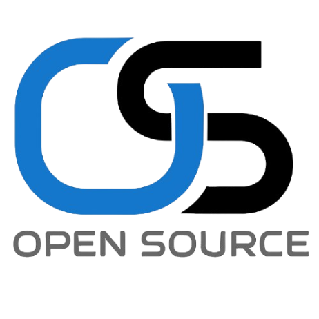

---

# 🎯 OpenSource Debug Challenge

**Interactive Code Debugging Platform for T.I.P Manila Academic Club**

A modern web application where students can practice debugging skills by fixing real code errors in Python, Java, HTML, and CSS. Built with Next.js and AWS, designed for beginner programmers.

---

## 🚀 Features

🎮 Interactive Debugging

* Real Code Editing: Fix actual syntax errors, missing semicolons, unclosed tags
* 4 Programming Languages: Python, Java, HTML, CSS
* 10 Random Challenges per session from a pool of 20 per language
* 1-minute Timer per challenge with auto-advance
* Tab Key Support for proper code indentation

⚡ Speed-Based Scoring System

* Lightning Fast (< 15s): 25 points
* Quick Fix (15–30s): 20 points
* Steady Progress (30–45s): 15 points
* Got There (45–60s): 10 points
* Hint Penalty: -5 points

🏆 Competitive Features

* Real-time Leaderboard with top 3 podium
* Achievement Levels: Code Ninja, Debug Expert, Bug Hunter, Code Learner
* QR Code Integration for additional resources
* Hint System when students get stuck

---

## 📋 Prerequisites

* Node.js 18+
* npm or yarn
* AWS account

---

## 🛠️ Installation

1. Clone the repository
   git clone [https://github.com/opensociety-tip/debug-challenge.git](https://github.com/opensociety-tip/debug-challenge.git)
   cd debug-challenge

2. Install dependencies
   npm install

3. Set up environment variables
   cp .env.example .env.local

4. Configure your database (see database setup)

5. Run the development server
   npm run dev

6. Open your browser and go to [http://localhost:3000](http://localhost:3000)

---

## 🎯 Scoring Criteria

### Points Per Challenge

| Speed Range         | Points     | Badge              |
| ------------------- | ---------- | ------------------ |
| `< 15 seconds`      | **25 pts** | ⚡ Lightning Fast   |
| `15 – 30 seconds`   | **20 pts** | 🚀 Quick Fix       |
| `30 – 45 seconds`   | **15 pts** | 📈 Steady Progress |
| `45 – 60 seconds`   | **10 pts** | ✅ Got There        |
| **Used Hint**       | **–5 pts** | 💡 Hint Penalty    |
| **Wrong / Timeout** | **0 pts**  | ❌ No Points        |

### Achievement Levels

| Score Range | Level        | Badge       | Description                       |
| ----------- | ------------ | ----------- | --------------------------------- |
| `200 – 250` | Code Ninja   | 🥷 Master   | Lightning-fast debugging skills   |
| `150 – 199` | Debug Expert | 🔧 Expert   | Excellent problem-solving ability |
| `100 – 149` | Bug Hunter   | 🐛 Hunter   | Solid debugging fundamentals      |
| `< 100`     | Code Learner | 📚 Learning | Keep practicing and improving!    |

---

## 🎮 Challenge Types by Language

🐍 Python

* Syntax errors, indentation, colons
  Example:
  def greet(name)
  return "Hello, " + name

Fix:
def greet(name):
return "Hello, " + name

☕ Java

* Semicolons, syntax, class/method structure
  Example:
  System.out.println("Hello")

Fix:
System.out.println("Hello");

🎨 CSS

* Missing semicolons, invalid syntax
  Example:
  .container {
  width: 100%
  height: 200px;
  }

Fix:
.container {
width: 100%;
height: 200px;
}

---

## 🎨 Technologies Used

* Frontend: Next.js 14, React, TypeScript
* Styling: Tailwind CSS, shadcn/ui
* Database: MongoDB Atlas or AWS DynamoDB
* Deployment: Vercel
* Icons: Lucide React
* State: React Hooks

---

## 🤝 Contributing

1. Fork the repo
2. Create a branch:
   git checkout -b feature/my-feature
3. Commit:
   git commit -m "Add my feature"
4. Push:
   git push origin feature/my-feature
5. Open a Pull Request

---

## 📝 Adding New Challenges

Go to lib/challenges.ts and add challanges

---

## 🎓 Educational Goals

This platform helps students:

* Practice Real Debugging
* Learn by Doing
* Build Speed
* Understand Syntax
* Gain Confidence

---

## 📊 Analytics & Insights

* Track average completion time
* See most common error types
* Monitor score improvements
* Analyze language popularity

---

## 🔧 Customization

Add New Language

1. Add challenge array in lib/challenges.ts
2. Add language selector in app/page.tsx
3. Adjust logic in code-editor.tsx if needed

Edit Scoring
Modify calculatePoints() in code-editor.tsx

---

## 🙏 Acknowledgments

* T.I.P Manila
* OpenSource Academic Club
* All students using the platform

---

**Built with ❤️ by OpenSource Academic Club – T.I.P Manila 2025**
Empowering the next generation of developers through interactive learning.

---

